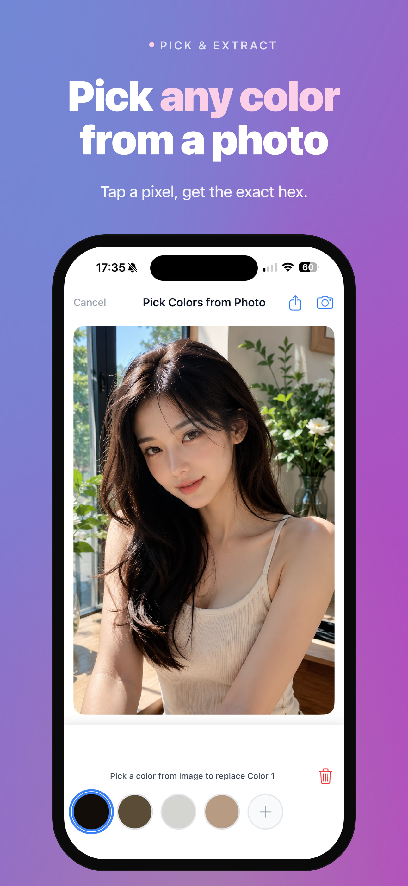
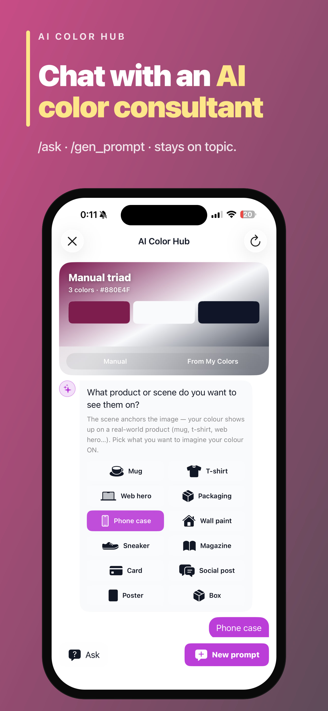
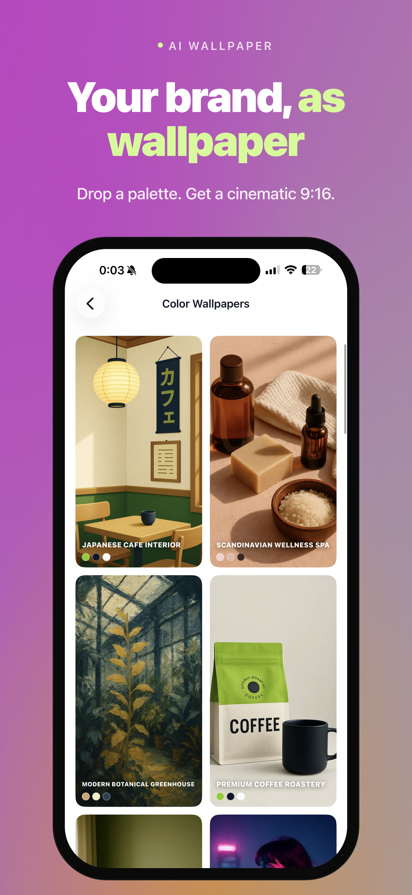
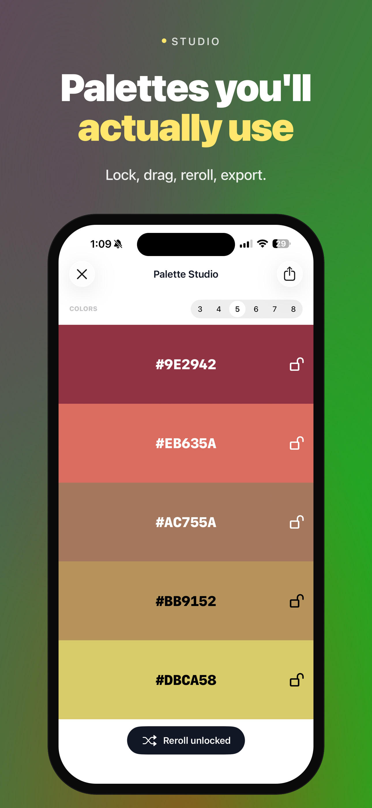
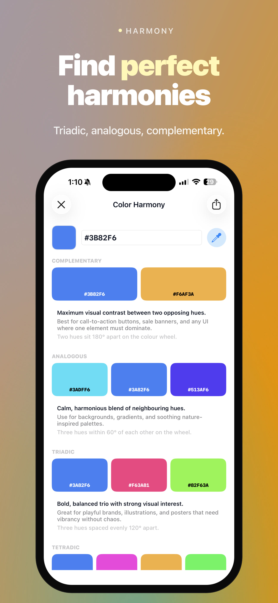
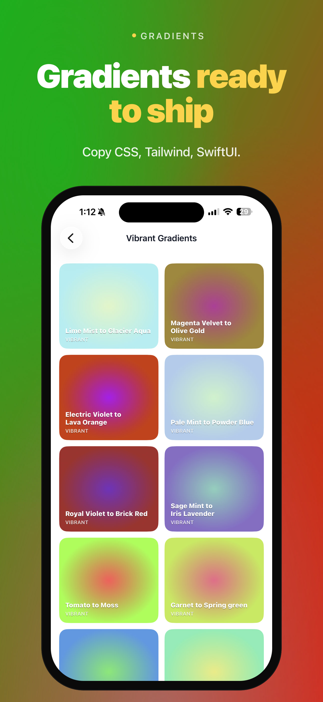
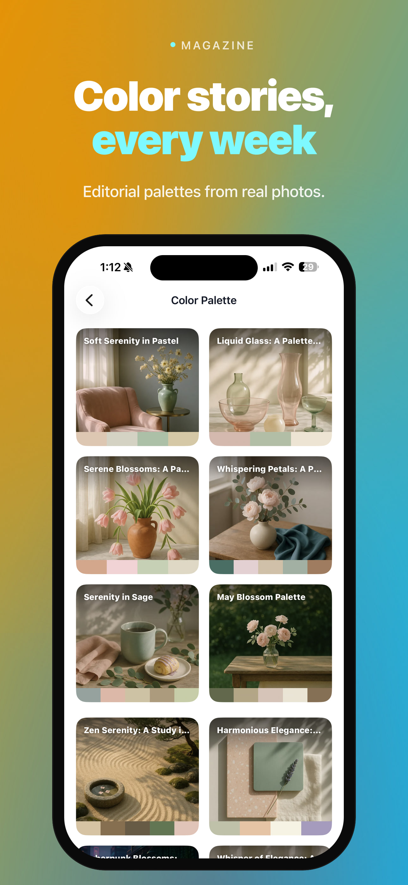
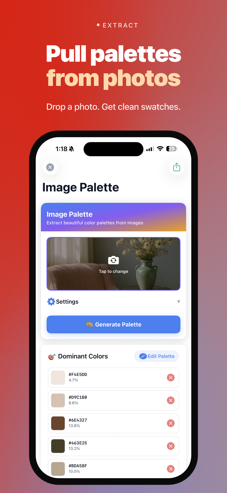
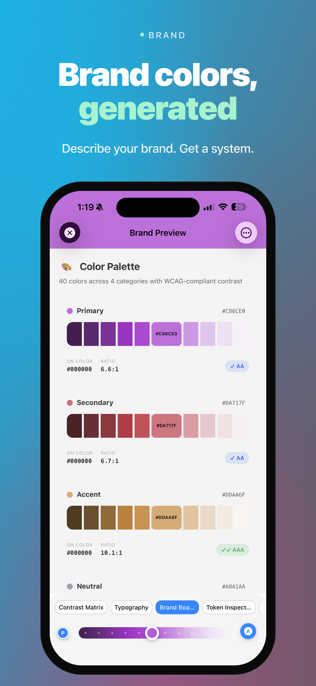
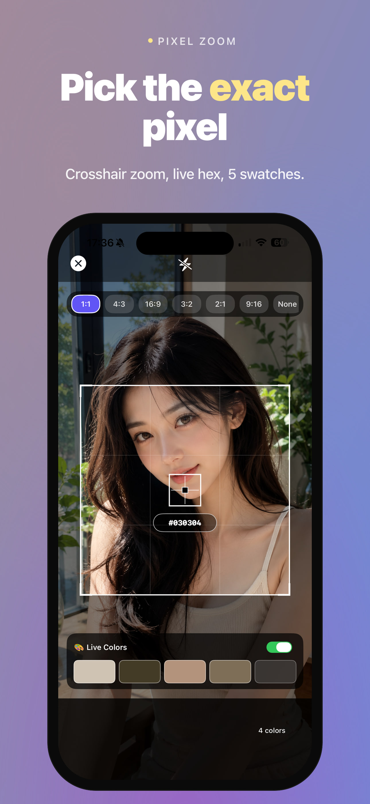

# pixeliro-screenshots-app

> App Store screenshots for **Color Picker · Pixel Color**.  
> Powered by [`@pixeliro/store-push`](../store-push).

---

## Links

| | |
|---|---|
| iOS App Store | [Color Picker · Pixel Color](https://apps.apple.com/us/app/color-picker-pixel-color/id1400884755) |
| Web | [pixeliro.com](https://pixeliro.com) |
| Brand palettes | [pixeliro.com/brand-palettes](https://pixeliro.com/brand-palettes) |
| Brand generator | [pixeliro.com/brand-color-palette](https://pixeliro.com/brand-color-palette) |

---

## Preview — iPhone 6.9" · English

> Run `npm run gen:preview` to regenerate these from source screenshots.

| 01 Pick from Photo | 02 Color Prompt AI | 03 Wallpaper |
|---|---|---|
|  |  |  |

| 04 Palette Studio | 05 Color Harmony | 06 Gradient |
|---|---|---|
|  |  |  |

| 07 Magazine | 08 Extract | 09 Brand |
|---|---|---|
|  |  |  |

| 10 Pixel Zoom | — | — |
|---|---|---|
|  | | |

---

## Devices & output sizes

| Device ID | Label | Canvas | Notes |
|---|---|---|---|
| `iphone` | iPhone 6.9" | 1290×2796 | App Store primary |
| `ipad` | iPad Pro 13" | 2064×2752 | App Store required for iPad |
| `iphone-landscape` | iPhone Landscape | 2796×1290 | App Store optional |
| `ipad-landscape` | iPad Landscape | 2752×2064 | App Store optional |
| `apple-search-ads` | Search Ads Banner | 2796×900 | ASA optional |
| `google-ads-landscape` | Google Ads Landscape | 1200×628 | GDN / UAC |
| `google-ads-square` | Google Ads Square | 1200×1200 | GDN / UAC |
| `google-ads-portrait` | Google Ads Portrait | 1080×1920 | UAC story |

---

## Locales

`en-US` · `vi` · `de-DE` · `es-ES` · `fr-FR` · `ja` · `ko` · `zh-Hans`

---

## Folder structure

```
pixeliro-screenshots-app/
├── compose.config.json     ← screens[], devices, typography — single source of truth
├── input/                  ← raw simulator screenshots (one folder per screen)
│   ├── 01/
│   │   ├── iphone.png      ← iPhone 16 Pro Max simulator
│   │   ├── ipad.png        ← iPad Pro 13" simulator
│   │   └── promo.png       ← optional key art for banners
│   └── ...
├── preview/                ← iphone/en-US snapshots committed for README display
├── output/                 ← generated output (gitignored, rebuilt by npm run gen)
│   ├── iphone/
│   │   ├── en-US/
│   │   │   ├── 01.jpg
│   │   │   └── ...
│   │   └── vi/ ...
│   ├── ipad/
│   ├── iphone-landscape/
│   ├── ipad-landscape/
│   └── apple-search-ads/
└── README.md
```

---

## Brand theme colors

Screenshot backgrounds are driven by `input/brand-theme.txt`.  
Replace this file with a fresh export from **Pixeliro Brand System** to apply new colors.

### Method 1 — From Brand Palettes gallery

1. Open **[pixeliro.com/brand-palettes](https://pixeliro.com/brand-palettes)**
2. Click any palette → detail page opens:  
   `https://pixeliro.com/brand-color-palette/<uuid>`
3. Click tab **Export** → format **Other → Plain Text**
4. Download → replace `input/brand-theme.txt`

### Method 2 — From Brand Color Generator

1. Open **[pixeliro.com/brand-color-palette](https://pixeliro.com/brand-color-palette)**
2. Describe your brand → click **Generate**
3. Click **View Details** button  
   → opens `https://pixeliro.com/brand-color-palette/<slug>`
4. Click tab **Export** → **Other → Plain Text**
5. Download → replace `input/brand-theme.txt`

### Apply colors

```bash
npm run gen:theme:preview    # quick check — iphone × en-US
npm run gen:theme:brand      # all devices × all locales
npm run gen:theme:random     # random palette (no brand-theme.txt needed)
```

---

## Quick start

```bash
# 1. Drop simulator screenshots into input/<slug>/
#    See input/README.md for capture guide.

# 2. Generate
npm run gen              # all devices × locales × screens
npm run gen:iphone       # iPhone only
npm run gen:ipad         # iPad only
npm run gen:portrait     # iphone + ipad
npm run gen:landscape    # landscape variants

# Filter
npm run gen -- --locale=vi
npm run gen -- --locale=en-US --device=iphone
npm run gen -- --slug=09

# 3. Regenerate preview (commit preview/ afterward)
npm run gen:preview
```

---

## Adding a new screen

1. Add a folder `input/11/` and drop simulator PNGs inside.
2. Add an entry to `screens[]` in `compose.config.json`:

```json
{
  "slug": "11",
  "background": { "from": "#1E1B4B", "to": "#0F766E", "mesh": "#34D399" },
  "textColor": "#FFFFFF",
  "accentColor": "#6EE7B7",
  "eyebrow": { "en-US": "CONTRAST", "vi": "TƯƠNG PHẢN" },
  "headline": { "en-US": "Pass *WCAG AA* automatically" },
  "subheadline": { "en-US": "Accessible alternatives in one tap." }
}
```

3. Run `npm run gen -- --slug=11`.

---

## Adding a new locale

Add the locale key to every `eyebrow`, `headline`, and `subheadline` in `compose.config.json`. The generator auto-detects locales — no other changes needed.

---

## Promo banners

All promo formats render **gradient + text only** — no device frame.  
Drop a `promo.png` inside each screen's input folder for a custom background image.

```bash
npm run gen:promo          # all promo formats
npm run gen:promo:asa      # Apple Search Ads only (2796×900)
npm run gen:promo:gads     # Google Ads only (landscape + square + portrait)

# → output/apple-search-ads/en-US/01.jpg      2796×900
# → output/google-ads-landscape/en-US/01.jpg  1200×628
# → output/google-ads-square/en-US/01.jpg     1200×1200
# → output/google-ads-portrait/en-US/01.jpg   1080×1920
```

---

## Powered by

- [sharp](https://sharp.pixelplumbing.com) — image compositing
